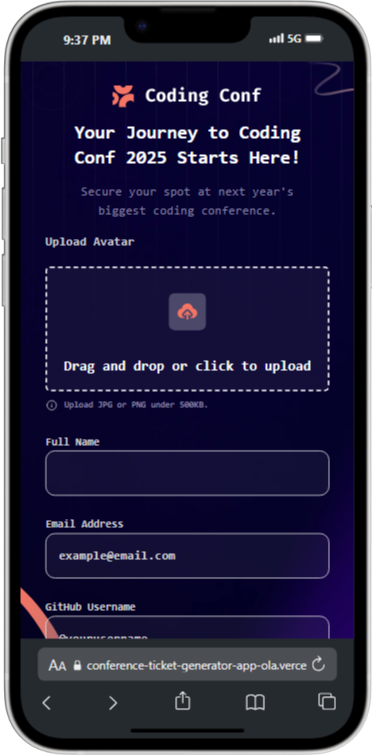
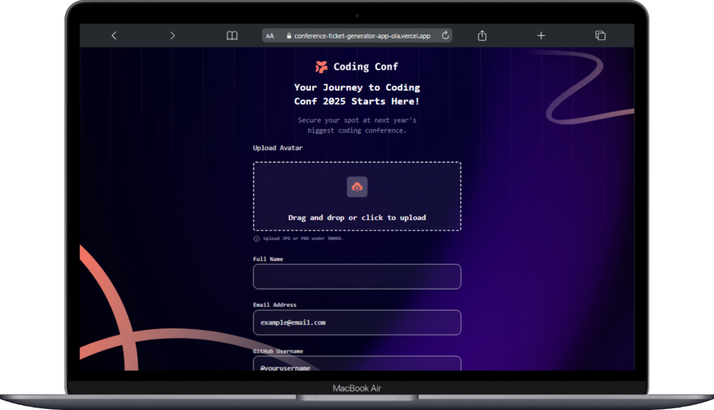
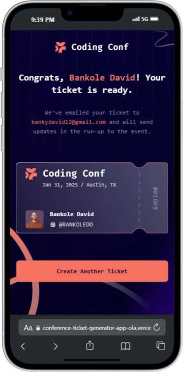
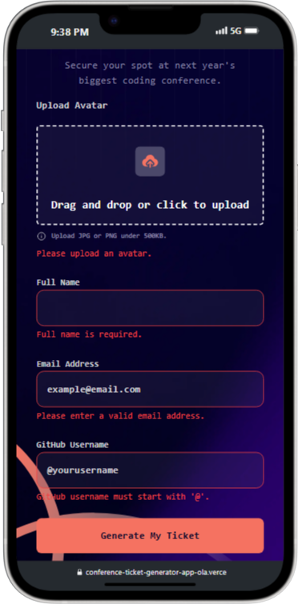

# Frontend Mentor - Conference Ticket Generator Solution

This is my solution to the [Conference Ticket Generator challenge on Frontend Mentor](https://www.frontendmentor.io/challenges/conference-ticket-generator-oq5gFIU12w). It helps reinforce accessibility, responsive design, and real-world form handling using React and Tailwind CSS.

---

## 📑 Table of Contents

- [Overview](#overview)
  - [The Challenge](#the-challenge)
  - [Screenshot](#screenshot)
  - [Links](#links)
- [My Process](#my-process)
  - [Built With](#built-with)
  - [What I Learned](#what-i-learned)
- [Author](#author)
- [Acknowledgments](#acknowledgments)

---

## 📌 Overview

### 🎯 The Challenge

Users should be able to:

- Fill out a form with:
  - Full name
  - Email address (valid format)
  - GitHub username (starting with "@")
  - Upload an avatar image (JPG or PNG, under 500KB)
- See validation messages on errors
- Navigate the form entirely with a keyboard
- Experience accessible form labels, hints, and error messages
- View a dynamically generated ticket on successful submission
- Enjoy a responsive UI optimized for mobile, tablet, and desktop
- See hover and focus states on all interactive elements

---

### 🖼️ Screenshot

Mobile View



Desktop View



Success-State



Error-Stae



---

### 🔗 Links

- **Solution URL:** [My Frontend Mentor Solution](https://www.frontendmentor.io/solutions/conference-ticket-generator-using-react-tailwindcss-l6HFHMHFc_)
- **Live Site URL:** [Live Demo](https://conference-ticket-generator-app-ola.vercel.app/)

---

## 🛠 My Process

### 🚧 Built With

- Semantic HTML5
- Tailwind CSS (utility-first styling)
- React (functional components with hooks)
- Mobile-first responsive design
- Vite (blazing fast dev build tool)
- CSS variables for color theming
- Accessible custom file upload interactions

---

### 📚 What I Learned

Working on this project helped me practice:

- **Drag and drop file uploads** in React
- **Client-side image validation** for type and file size
- **Managing controlled form inputs with real-time validation**
- Accessibility improvements like keyboard nav, ARIA considerations
- Using `z-index` properly to layer background elements behind content
- Layouts using `flex`, `gap`, and `bg-[url()]` in Tailwind

Here’s a sample of validation logic I’m proud of:

```js
const isGithubValid = (gh) => /^@[a-zA-Z0-9-]+$/.test(gh);
const isEmailValid = (email) => /^[^\s@]+@[^\s@]+\.[^\s@]+$/.test(email);
````
---

## 👤 Author

* Website – [olabanks.dev](https://olabanks.dev) *(coming soon)*
* Frontend Mentor – [@BANKOLEDO](https://www.frontendmentor.io/profile/BANKOLEDO)
* Twitter – [@dev\_olabanks](https://twitter.com/dev_olabanks)

---

## 🙏 Acknowledgments

Thanks to the Frontend Mentor community for inspiration and guidance.

Special appreciation to the React docs, Tailwind community, and fellow frontend learners on Twitter.

---
